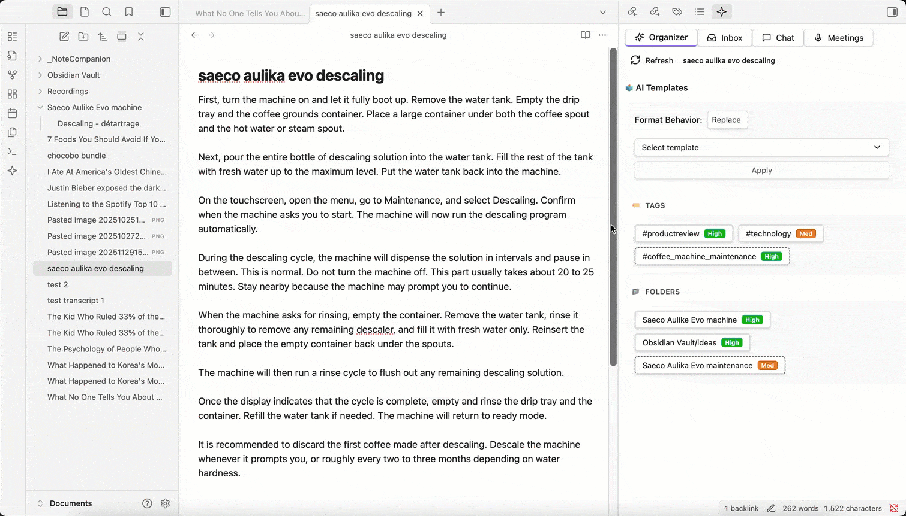
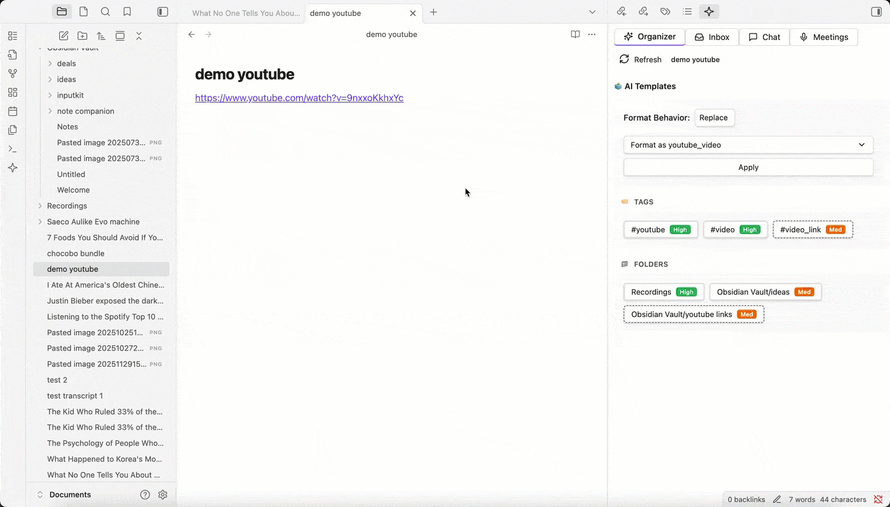
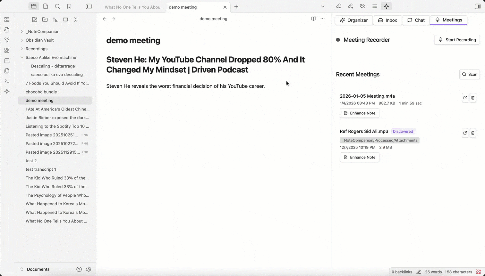

# Note Companion (formerly File Organizer 2000)

Turn messy captures into clean, searchable notes — **transcribe audio/YouTube, chat with your vault, and auto-organize files** right inside Obsidian.
Works with **Note Companion Cloud**, **your own AI API keys**, or **self-hosting**.

> ✅ Best for: researchers, students, meeting-heavy workflows, and anyone with an "Inbox" full of unprocessed notes.

---

## What you can do

- 🎬 **Transcribe YouTube videos** (multi-language, works even when captions aren't available in the usual way)
- 🎙️ **Transcribe audio & video files** (handles large files reliably)
- 🧠 **Chat with your notes** using vault context (mention files/folders/tags)
- 🗂️ **Auto-organize & format notes** (folder/tag/title/template suggestions; optional "Inbox" automation)
- 🧾 **Meeting recorder → Enhance note** (transcript, discussion points, action items, embedded audio)
- 🔌 **Multiple AI providers**: OpenAI, Claude, Gemini, Groq, Ollama/local models, and custom base URLs
- 🏠 **Self-hosting supported** (Docker + service examples)

---

## Screenshots

_AI-powered tags, folders, and formatting suggestions_

_YouTube link → Transcript + Summary + Structured Notes_

_Chat with your notes using @mentions for files, folders, and tags_

_Record meetings, then enhance notes with transcript, discussion points, and action items_

---

## Install

**Obsidian → Settings → Community plugins → Browse → "Note Companion" → Install → Enable**

---

## 60-second setup

1. Open **Settings → Note Companion**
2. Choose your mode:
   - **Note Companion Cloud** (sign in at [notecompanion.ai](https://notecompanion.ai) and enter your license key)
   - **Bring your own keys** (OpenAI / Claude / Gemini / etc. — paste your API key)
   - **Self-hosted backend** (paste your Base URL + key if needed)
3. Test it:
   - Open Command Palette → **Note Companion: Open Chat**
   - Ask: "Summarize this note and suggest tags"

---

## Quick workflows

### 1) YouTube → Note

1. Copy a YouTube link
2. In **Note Companion Chat**, paste the link
3. Get transcript + summary + optional structured notes

### 2) Audio recording → Meeting note (best demo)

1. Open **Meetings** tab → Start Recording
2. Stop Recording → select a note → **Enhance Note**
3. You'll get:
   - embedded audio
   - transcript
   - discussion points + action items

### 3) Inbox auto-organization

1. Create an Inbox folder (configured in settings)
2. Drop raw notes / links inside
3. Note Companion suggests (or auto-applies) folder + tags + title + formatting

---

## Providers & privacy

Note Companion can run using:

- **Note Companion Cloud**, or
- **Your own API keys** (OpenAI/Claude/Gemini/etc.), or
- **Local/self-hosted models** (e.g., Ollama + custom base URL)

Your data handling depends on the provider you choose.
View our full privacy policy at [notecompanion.ai/privacy](https://notecompanion.ai/privacy)

**Cloud Service:**

- Files are processed through our secure API for AI analysis
- Usage statistics collected for billing and rate limits
- Your vault content remains private and is only processed when you explicitly use plugin features

**Self-hosted / Your API Keys:**

- All processing happens on your own infrastructure
- Data never leaves your control
- No usage tracking

---

## Self-hosting

Want full control and local infrastructure?

➡️ See **[SELF-HOSTING.md](SELF-HOSTING.md)** for Docker + service setups and security notes.

---

## Troubleshooting

**If transcription fails:**

- Check provider key, model availability, and file size limits
- Verify API key is valid and has sufficient credits
- For large files (>25MB), consider splitting or compressing

**If YouTube import fails:**

- Try a different fallback method
- Ensure the video is accessible and not private/restricted
- Check network connectivity

**If local model doesn't respond:**

- Verify Base URL and CORS/network settings
- Ensure the local server (e.g., Ollama) is running
- Check firewall settings

**If plugin can't connect to server:**

- Verify server URL in settings (check for typos)
- Test connection using "Test Connection" button
- Check firewall/network settings

**If chat doesn't work:**

- Verify API key is set correctly
- Check model availability for your provider
- Review error messages in plugin console (Settings → Note Companion → Advanced → Open Console)

---

## Support / feedback

- **GitHub Issues**: [Report bugs or request features](https://github.com/Nexus-JPF/note-companion/issues)
- **Documentation**: [notecompanion.ai/docs](https://notecompanion.ai/docs)
- **Website**: [notecompanion.ai](https://notecompanion.ai)
- **Obsidian Forum**: [Share feedback and discuss](https://forum.obsidian.md) _(add forum thread link when available)_

---

## For developers

If you want to build or contribute, start here: **[CONTRIBUTING.md](CONTRIBUTING.md)**

---

## Important Disclosures

### Account & Payment Requirements

- **Payment required for cloud service**: The plugin requires a paid subscription to use the cloud-hosted service
- **7-day free trial**: New subscriptions include a 7-day trial period
- **Self-hosting option available**: You can run your own instance for free (see [Self-Hosting](#self-hosting) above)
- **Account creation**: Using the cloud service requires creating an account at [notecompanion.ai](https://notecompanion.ai)

### Network Usage

This plugin communicates with the following remote services:

- **Note Companion API Server** (cloud service): For AI-powered features including file classification, formatting, transcription, and chat
- **YouTube API**: For fetching video transcripts when processing YouTube links
- **AI Provider APIs**: When self-hosting or using your own keys, you'll connect directly to your chosen AI provider (OpenAI, Anthropic, Google, etc.)

---

## License

This project is licensed under the MIT License - see the [LICENSE](LICENSE) file for details.
